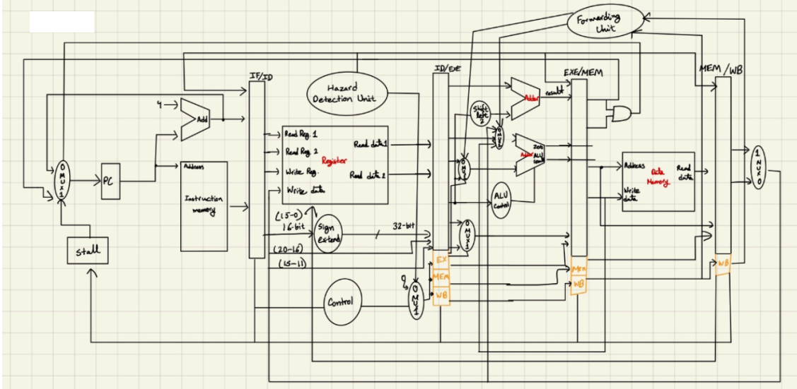

# MIPS Processor

A simple MIPS processor in Verilog as a classic five-stage pipeline. It is
written as synthesizable hardware and then run in simulation, where a compiled
MIPS program is loaded into memory and the processor executes it one cycle at a
time. A working pipelined processor is built that runs real MIPS programs
and produces the correct results while handling the hazards that come with
pipelining.

The processor has stages for Instruction Fetch (IF), Instruction Decode (ID),
Execute (EXE), Memory Access (MEM), and Write Back (WB), separated by four
pipeline registers (IF/ID, ID/EXE, EXE/MEM, MEM/WB). The IF stage fetches
instructions using the PC and updates it either sequentially or based on a branch
target. The ID stage decodes the instruction, reads the register file, resolves
branches early, and prepares the operands. The EXE stage performs the ALU work,
including arithmetic, logical, and shift operations. The MEM stage handles loads
and stores to data memory, and the WB stage writes the result, from either memory
or the ALU, back into the register file. Each pipeline register buffers the data
and control signals a stage needs and supports stalling and flushing so the
stages stay synchronized.

Because several instructions are loaded at once, the design needs to handle data and
control hazards. Hazard detection stalls or flushes the pipeline for load-use and
control hazards when needed, and forwarding avoids unnecessary stalls by rerouting
a result from a later stage straight back to the ALU inputs. The design also
starts with a 241-cycle boot phase to avoid hazards during early startup, then
transitions to full pipelined execution, which keeps the instruction flow correct
during startup while still running the test programs at full speed afterward.

## Framework

*5 stages (IF, ID, EXE, MEM, WB) separated by the IF/ID, ID/EXE, EXE/MEM, and
MEM/WB pipeline registers. Control signals are decoded once in ID and carried
forward in the EX/MEM/WB bundle, each part being used at the stage it belongs to.
The forwarding unit routes results from EXE/MEM and MEM/WB back to the ALU inputs,
and the hazard detection unit stalls the PC and IF/ID and flushes ID/EXE on a
load-use hazard.*

The top module in cpu_top.v wires the whole processor together and connects all
the stages and pipeline registers. The five stages live in fetch_stage.v,
decode_stage.v, execute_stage.v, memory_stage.v, and the write back path, and the
latches between them are if_id_register.v, id_ex_register.v, ex_mem_register.v,
and mem_wb_register.v. The supporting blocks are control_unit.v, which turns an
instruction into the control signals the rest of the pipeline uses, alu_unit.v for
the arithmetic and logic operations, branch_unit.v for deciding whether a branch
is taken, register_file.v for the 32 registers, and next_pc.v for computing the
next instruction address.

Hazard handling is split between two units. The hazard detection logic in
hazard_unit.v watches the register source and destination fields carried in the
IF/ID, ID/EXE, EXE/MEM, and MEM/WB registers and looks for dependencies. When a
load in ID/EXE is immediately followed by an instruction that needs the loaded
value, it inserts one bubble by stalling the PC and IF/ID and flushing ID/EXE so
the value is ready in time. Control hazards are kept small by resolving branches
in the ID stage instead of EXE, so a wrong-path instruction can be flushed sooner.
Structural hazards do not occur because instruction and data memory are separate.

The forwarding logic in forwarding_unit.v exists to avoid stalling whenever the
data a dependent instruction needs is already computed but not yet written back.
It checks whether EXE/MEM or MEM/WB holds a result that a later instruction in the
EXE stage depends on, and if so it drives the muxes in front of the ALU to select
the forwarded value instead of the stale register file output. This resolves most
data hazards with no stall at all, so the pipeline keeps moving while still
producing correct results.

The processor is exercised through a C++ simulation harness kept in the sim_main
folder. This part came from a base framework and acts as the surrounding system:
it loads a compiled program into a simulated memory, models the syscalls the
program uses so it can print output and exit, and drives the processor's clock and
reset while the simulation runs. The design is compiled to a C++ model with
Verilator and linked against this harness.

## Running

Run make, Makefile fetches and builds a
version of Verilator the first time (which takes a while), compiles the Verilog
into a C++ model, to produce an executable called
VMIPS. Run a program by passing a compiled MIPS binary and a cycle limit, for
example `./VMIPS path/to/program 100000`.
