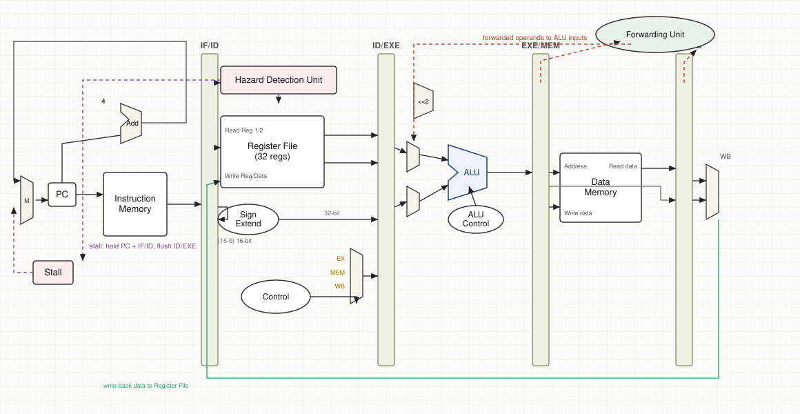

# Pipelined MIPS Processor

A five-stage MIPS processor written in Verilog. It runs compiled MIPS programs in
simulation, one instruction per cycle, and handles the data and control hazards
that come with pipelining.

## The pipeline

The processor has five stages:

- **IF** — fetch the instruction at the PC.
- **ID** — decode it, read the registers, and resolve branches.
- **EXE** — do the ALU work (arithmetic, logic, shifts).
- **MEM** — read or write data memory.
- **WB** — write the result back to a register.

A pipeline register sits between each pair of stages: IF/ID, ID/EXE, EXE/MEM, and
MEM/WB. Each one latches its stage's results on the clock edge and passes them on,
so up to five instructions are in flight at once. A register can stall (hold its
value) or flush (clear to a bubble) when a hazard calls for it.

## Hazards and forwarding

Two small units keep the pipeline correct.

The forwarding unit handles most data hazards. When an instruction needs a result
that an earlier instruction has already computed but not yet written back, it
sends that value straight to the ALU input instead of waiting. No stall is needed.

The hazard detection unit handles what forwarding can't. The main case is a load
followed right away by an instruction that uses the loaded value. There it stalls
one cycle: it holds the PC and IF/ID and turns the ID/EXE control signals into a
bubble. Branches are resolved in ID, so a wrong path costs just one flushed
instruction. Structural hazards never happen, since instruction and data memory
are separate.

## Files

`verilog/` is the hardware:

- `cpu_top.v` — top module, wires everything together
- `fetch_stage.v`, `decode_stage.v`, `execute_stage.v`, `memory_stage.v` — the stages
- `if_id_register.v`, `id_ex_register.v`, `ex_mem_register.v`, `mem_wb_register.v` — the pipeline registers
- `control_unit.v`, `alu_unit.v`, `branch_unit.v`, `register_file.v`, `next_pc.v` — decode, ALU, branch test, registers, next-PC
- `hazard_unit.v`, `forwarding_unit.v` — the hazard and forwarding logic

`sim_main/` is a C++ harness (from a base framework) that loads a program into
memory, models the syscalls it uses, and drives the clock. `tests/` holds a
sample program.

## Build and run

Run `make`. It builds Verilator the first time (slow), compiles the Verilog to a
C++ model, and links it into an executable called `VMIPS`. Run it with a program
and a cycle limit:

    ./VMIPS path/to/program 100000

Run `VMIPS` with no arguments to see the debug options.
